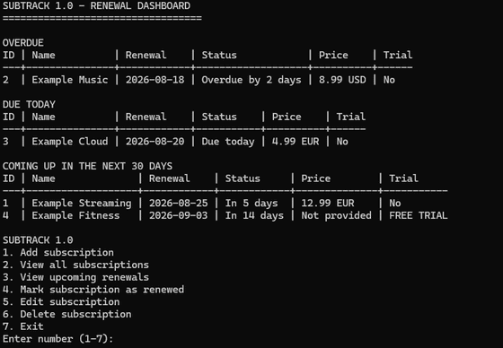

# SubTrack 1.0

[](https://github.com/SpaceFanis/subtrack/actions/workflows/tests.yml)

SubTrack is a command-line subscription tracker that helps people notice
renewals before they become surprises. It shows overdue, due-today, and
upcoming renewals whenever the program starts, while keeping subscription data
in a simple local JSON file.

The project is written with the Python standard library. It was designed as a
small, understandable application with separate command-line, business-logic,
and storage responsibilities.

## The problem

Digital subscriptions are easy to forget because they renew at different
times. A list of subscriptions is useful, but a list alone does not tell the
user what needs attention now. SubTrack turns that list into a renewal
dashboard and gives the user a focused way to record the next renewal after a
payment occurs.

SubTrack warns the user when it runs. It does not send background or operating
system notifications.

## Features

- Add, view, edit, and delete subscriptions.
- See overdue renewals, renewals due today, and renewals due in the next 30
  days.
- Mark a subscription as renewed and enter its next renewal date.
- Track whether a subscription is currently a free trial.
- Optionally store the exact amount and currency expected at the next renewal.
- Keep stable subscription IDs after records are deleted.
- Store data locally in `data.json` with strict validation and clear errors.

## Demo



## Requirements

- Python 3.10 or newer

The application has no third-party runtime dependencies.

## Run SubTrack

Clone the repository, enter its directory, and run:

```bash
python project.py
```

On Windows, if `python` is not available but the Python launcher is installed,
use:

```powershell
py project.py
```

SubTrack creates `data.json` beside `project.py` the first time it runs. This
file contains local user data and is ignored by Git.

## Main menu

```text
1. Add subscription
2. View all subscriptions
3. View upcoming renewals
4. Mark subscription as renewed
5. Edit subscription
6. Delete subscription
7. Exit
```

An optional price represents the amount expected at the next renewal. SubTrack
does not calculate monthly spending, convert currencies, or automatically
calculate future dates.

## Architecture

```text
project.py
    Command-line prompts, menus, tables, and user-facing messages
        |
        +---- subscriptions.py
        |     Validation and subscription business rules
        |
        +---- storage.py
              Strict JSON loading, validation, and saving
```

The typical data flow is:

```text
User input -> CLI validation -> subscription operation -> storage validation
           -> data.json
```

Separating these responsibilities keeps the application logic directly
testable without requiring interactive input or access to the user's real data
file.

## Stored data

The JSON file has this shape:

```json
{
    "Subscriptions": [
        {
            "id": 1,
            "name": "Example",
            "date_of_addition": "2026-08-09",
            "renewal_date": "2026-09-09",
            "free_trial": false,
            "renewal_price": "12.99",
            "currency": "EUR"
        }
    ],
    "next_id": 2
}
```

`renewal_price` and `currency` are both `null` when no price is provided.
Prices are stored as exact two-decimal strings so they do not suffer from
floating-point rounding errors. The storage validator requires exactly the
documented fields, so missing or unexpected fields are rejected.

## Tests

Install the development dependencies:

```bash
python -m pip install -r requirements-dev.txt
```

Run the complete suite:

```bash
python -m pytest
```

The tests are separated into domain, storage, and CLI behavior. Filesystem
tests use pytest temporary directories and never modify the real `data.json`.
GitHub Actions runs the suite on Python 3.10 and Python 3.13.

## Design decisions

- JSON keeps local persistence visible and understandable for this project's
  size.
- Functions and dictionaries keep the architecture appropriate for a first
  serious Python project.
- `Decimal` validates prices before they are stored as exact strings.
- Renewal dates are entered manually; billing-cycle automation is deliberately
  outside the 1.0 scope.
- The CLI uses only plain text so no runtime UI package is required.

## Current limitations

SubTrack does not provide background notifications, automatic billing cycles,
spending analytics, currency conversion, accounts, cloud synchronization, or a
graphical interface. These exclusions keep version 1.0 focused on one problem:
making renewal risk visible when the application runs.

## License

This project is available under the [MIT License](LICENSE).
